# 株式会社ゆめみ Android エンジニアコードチェック課題

## 概要

本プロジェクトは株式会社ゆめみ（以下弊社）が、弊社に Android エンジニアを希望する方に出す課題のベースプロジェクトです。本課題が与えられた方は、下記の概要を詳しく読んだ上で課題を取り組んでください。

## アプリ仕様

本アプリは GitHub のリポジトリを検索するアプリです。

### 環境

- IDE：Android Studio Flamingo | 2022.2.1 Patch 2
- Kotlin：1.6.21
- Java：17
- Gradle：8.0
- minSdk：23
- targetSdk：31

※ ライブラリの利用はオープンソースのものに限ります。
※ 環境は適宜更新してください。

### 動作

1. 何かしらのキーワードを入力
2. GitHub API（`search/repositories`）でリポジトリを検索し、結果一覧を概要（リポジトリ名）で表示
3. 特定の結果を選択したら、該当リポジトリの詳細（リポジトリ名、オーナーアイコン、プロジェクト言語、Star 数、Watcher 数、Fork 数、Issue 数）を表示

## 課題取り組み方法

Issues を確認した上、本プロジェクトを [**Duplicate** してください](https://help.github.com/en/github/creating-cloning-and-archiving-repositories/duplicating-a-repository)（Fork しないようにしてください。必要ならプライベートリポジトリにしても大丈夫です）。今後のコミットは全てご自身のリポジトリで行ってください。

コードチェックの課題 Issue は全て [`課題`](https://github.com/yumemi-inc/android-engineer-codecheck/milestone/1) Milestone がついており、難易度に応じて Label が [`初級`](https://github.com/yumemi-inc/android-engineer-codecheck/issues?q=is%3Aopen+is%3Aissue+label%3A初級+milestone%3A課題)、[`中級`](https://github.com/yumemi-inc/android-engineer-codecheck/issues?q=is%3Aopen+is%3Aissue+label%3A中級+milestone%3A課題+) と [`ボーナス`](https://github.com/yumemi-inc/android-engineer-codecheck/issues?q=is%3Aopen+is%3Aissue+label%3Aボーナス+milestone%3A課題+) に分けられています。課題の必須／選択は下記の表とします。

|   | 初級 | 中級 | ボーナス
|--:|:--:|:--:|:--:|
| 新卒／未経験者 | 必須 | 選択 | 選択 |
| 中途／経験者 | 必須 | 必須 | 選択 |

課題 Issueをご自身のリポジトリーにコピーするGitHub Actionsをご用意しております。  
[こちらのWorkflow](./.github/workflows/copy-issues.yml)を[手動でトリガーする](https://docs.github.com/ja/actions/managing-workflow-runs/manually-running-a-workflow)ことでコピーできますのでご活用下さい。

課題が完成したら、リポジトリのアドレスを教えてください。

## 参考記事

提出された課題の評価ポイントに関しては、[こちらの記事](https://qiita.com/blendthink/items/aa70b8b3106fb4e3555f)に詳しく書かれてありますので、ぜひご覧ください。

## AIサービスの利用について

ChatGPTなどAIサービスの利用は禁止しておりません。

利用にあたって工夫したプロンプトやソースコメント等をご提出頂くことで、加点評価する場合もございます。 (減点評価はありません)

また、弊社コードチェック担当者もAIサービスを利用させていただく場合があります。

AIサービスの利用は差し控えてもらいたいなどのご要望がある場合は、お気軽にお申し出ください。

## アプリケーションのリファクタリング結果の概要

### 基礎
- 元のアプリケーションのバグを解決しました。
- 元のコードの不合理な変数名とフォーマットを調整しました。
- 変数、関数、およびパッケージの命名方法を命名規則に基づいて調整しました。
- 関連ライブラリファイルのバージョンを更新しました。
- コード構造を調整し、データ関連のビジネスロジックをUIから分離する。
- ネットワーク例外を処理し、ネットワーク例外が発生したときにユーザーにプロンプトを送信します。
- Compose関連ライブラリをインポートし、プロジェクトをComposeに移行しました。

### UI
- UIインタフェースを大幅に調整し、Material Design 3（Material You）に基づく最新の設計を導入しました。
- ダークモードに適合し、システム設定を適用して自動的にダークモードに入る。
- 適応UIを実現し、携帯電話の横画面や各種の大画面デバイスに適している。
- UIインタフェースにDynamic colorサポートを導入します。（Android 12以上）

### 新機能
- Jetpack Room ライブラリを導入し、Android local databaseのサポートを追加してデータの永続性を実現しました。
- 訪問履歴を表示および削除し、local databaseに閲覧履歴を保存する機能が追加されました。
- 検索履歴を表示および削除し、local databaseに検索履歴を保存する機能が追加されました。

### テスト機種
Sony XZ Premium(android 9)
Samsung Galaxy Tab S4(android 10)
Nexus 5(Virtual Device - android 12)
OnePlus 8(android 14)

### ScreenShot

Smartphone:
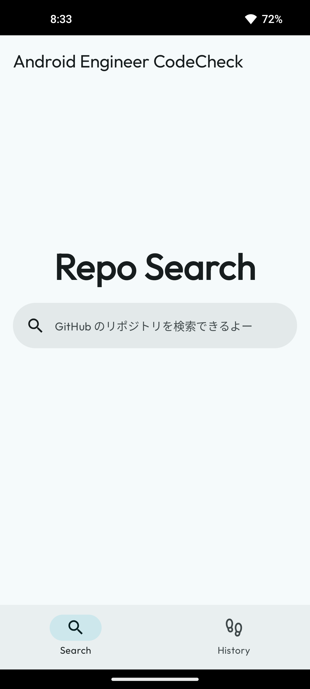   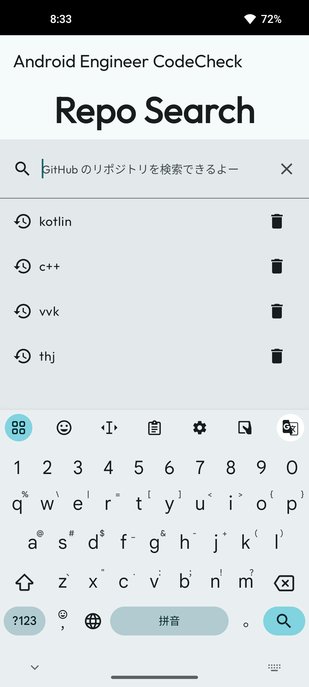   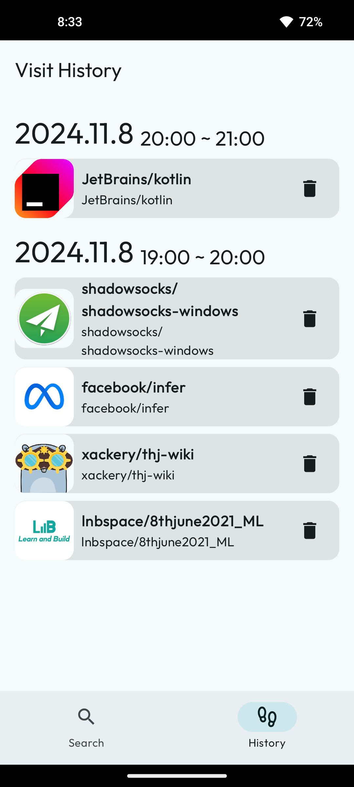
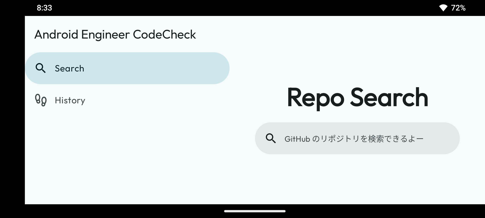   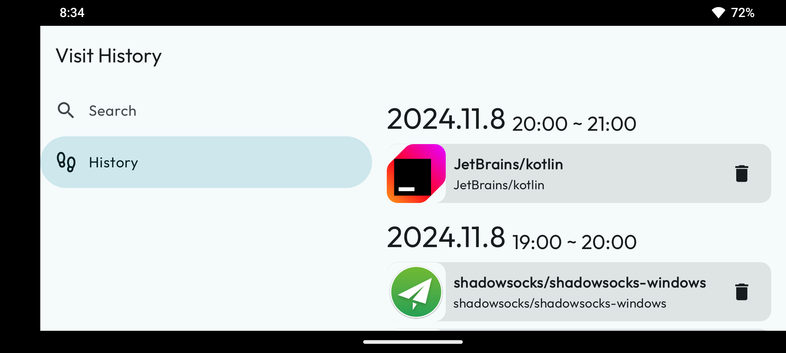

Tablet:
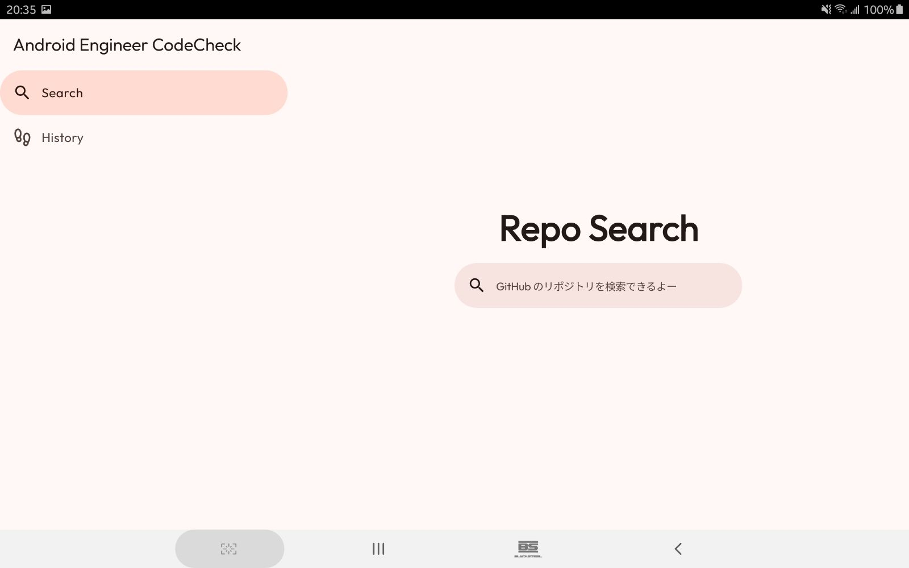   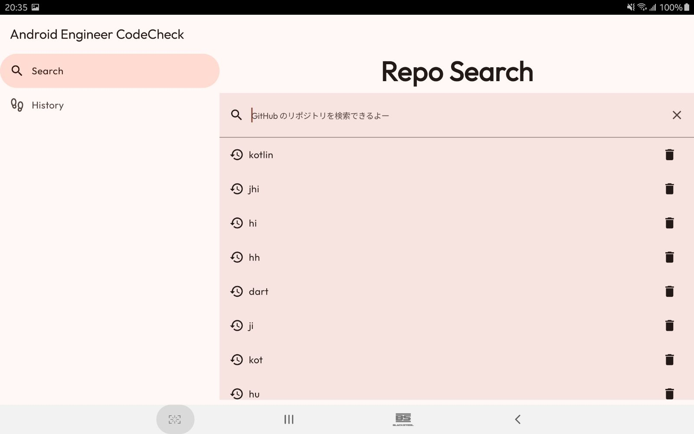
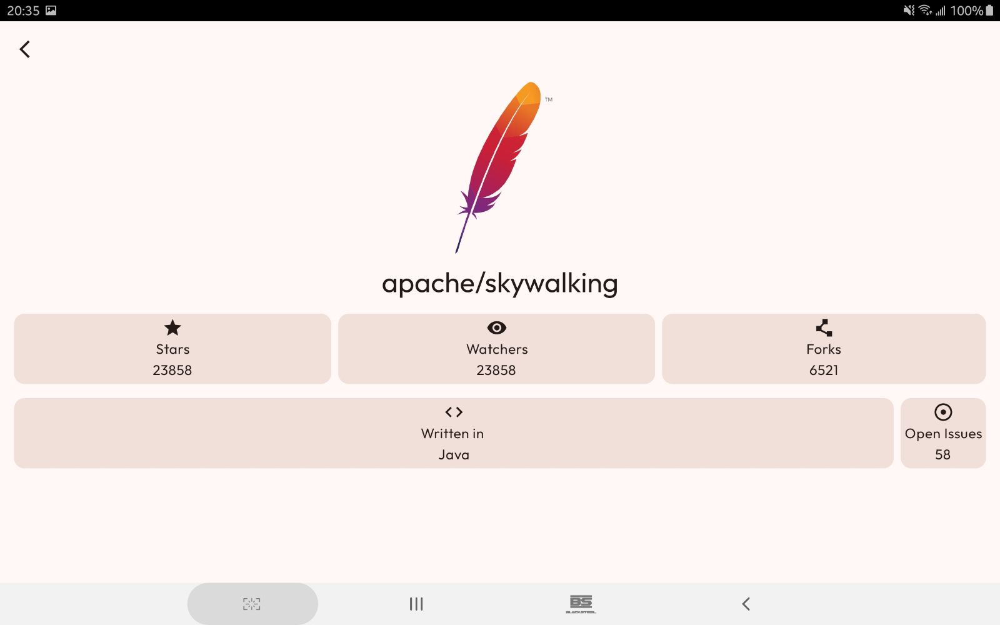   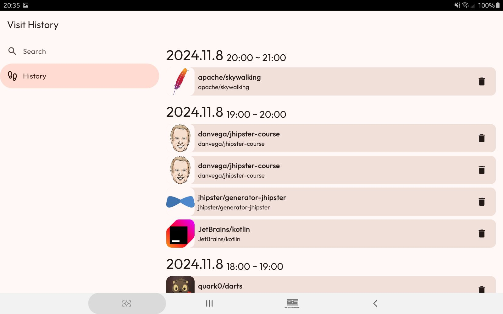
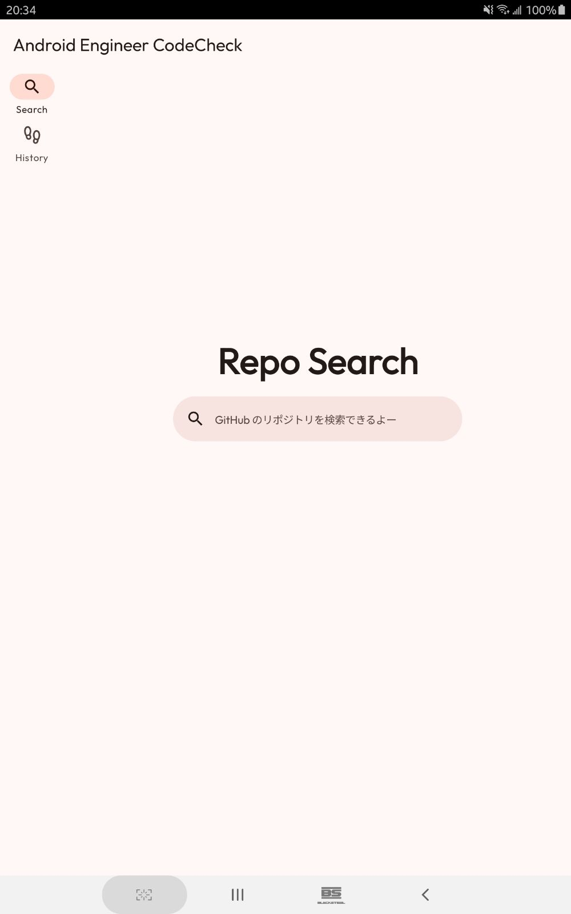   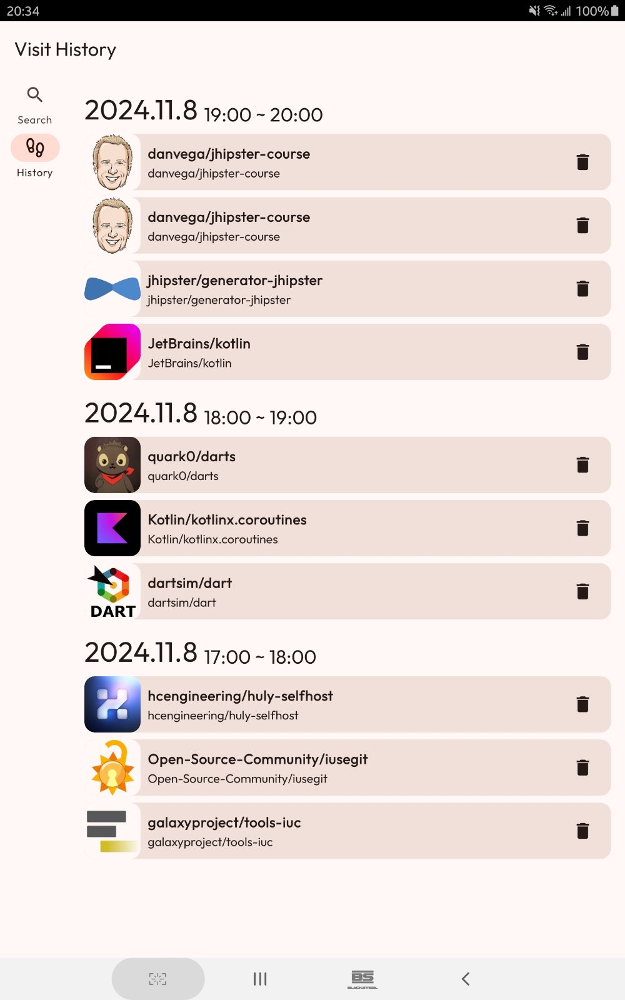

## Overview of application refactoring results

### Basics
- Fixed bugs in the original app.
- Adjustments have been made to the unreasonable variable names and formats in the original code.
- The names of variables, functions and packages have been adjusted according to the naming rules.
- Necessary updates have been made to relevant library file versions.
- The code structure was adjusted to separate data-related business logic from the UI.
- Handles network exceptions and prompts the user when a network exception occurs.
- Imported Compose libraries and migrated the project to Compose.

### UI
- Major adjustments have been made to the UI interface, using the latest design and guidelines based on Material Design 3 (Material You).
- Adapted to dark mode, the application theme automatically changes according to the system settings.
- An adaptive UI is implemented, adapting to the horizontal screen of mobile phones and various large-screen devices.
- Introduced dynamic color for UI interfaces. (Android 12 and above)

### New Features
- The Jetpack Room library is introduced to add support for Android local database for data persistence.
- Added the feature of viewing and deleting visit history, and saved the visit history in the local database.
- Added the feature of viewing and deleting search history, and save search history in the local database.

### Test Devices
Sony XZ Premium(android 9)
Samsung Galaxy Tab S4(android 10)
Nexus 5(Virtual Device - android 12)
OnePlus 8(android 14)